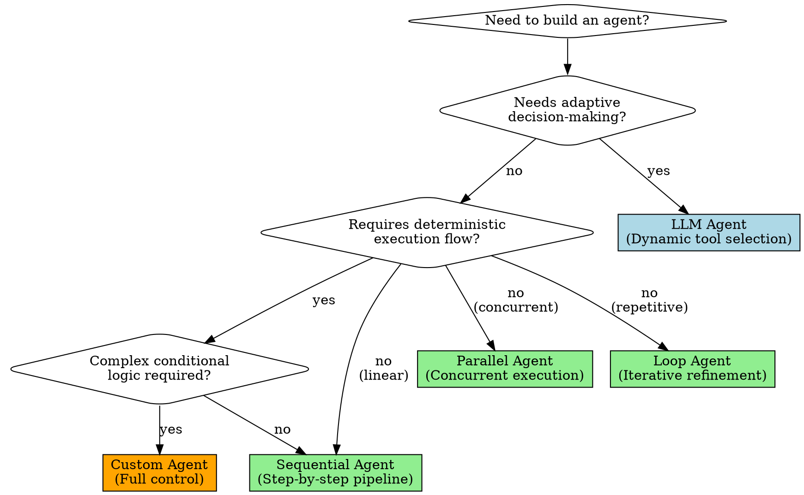

<EXTREMELY-IMPORTANT>
Google ADK is a code-first Python framework. Everything is Python code—no YAML, no visual builders.
This enables version control, testing, and standard IDE tooling.

IF YOU ARE BUILDING AGENTS WITH GOOGLE ADK, YOU MUST FOLLOW THIS SKILL.
</EXTREMELY-IMPORTANT>

# Google ADK Agent Builder

## Overview

Build production-ready AI agents using Google's Agent Development Kit with modular, testable Python code. Focus on composition—complex systems built from simple agent building blocks.

## When to Use

Use this skill when:
- Building new AI agents with Google ADK Python
- Designing multi-agent orchestrations (sequential, parallel, loop patterns)
- Implementing tools and state management
- Choosing between LLM agents, workflow agents, or custom agents
- Troubleshooting agent behavior or tool calling issues
- Deploying agents to Cloud Run, Vertex AI, or standalone environments

Do NOT use this skill for:
- Non-Python agent frameworks
- Visual/no-code agent builders
- Simple single-prompt LLM calls without orchestration

## The Iron Law

```
NO AGENT IMPLEMENTATION WITHOUT CLEAR REQUIREMENTS FIRST
```

Before writing any agent code:
1. Clarify the agent's specific purpose and scope
2. Identify required tools and data sources
3. Determine if single agent or multi-agent orchestration is needed
4. Understand state management requirements
5. Choose appropriate agent type(s)

**Violating this process means building the wrong architecture.**

## Agent Selection Decision Tree



## Quick Reference: Agent Types

| Agent Type | Use When | Capabilities | Limitations |
|-----------|----------|--------------|-------------|
| **LLM Agent** | Need adaptive reasoning and dynamic tool selection | Uses LLM for decisions; calls tools based on context | Can be unpredictable; requires clear instructions |
| **Sequential** | Tasks must happen in order | Deterministic pipeline; each step reads previous results | No parallelism; rigid execution |
| **Parallel** | Tasks can run simultaneously | Concurrent execution; faster for independent operations | No guaranteed order; results arrive async |
| **Loop** | Need iterative refinement | Repeated execution until condition met or max iterations | Fixed max iterations; no mid-loop branching |
| **Custom** | Conditional logic or complex routing | Full Python control; implement any orchestration pattern | More code to write and maintain |

## Mandatory First Steps Protocol

Before implementing ANY agent:

1. ☐ Define the agent's exact purpose in 1-2 sentences
2. ☐ List ALL required tools and data sources
3. ☐ Identify what data flows between agents (state keys)
4. ☐ Choose agent type using decision tree above
5. ☐ Write instruction text BEFORE writing agent code
6. ☐ Consider what could go wrong and how to handle it

**Responding without completing this checklist = building without a plan.**

## Common Patterns and Implementations

### Pattern 1: Single Agent with Tools

**When:** Simple Q&A or task execution with external data.

```python
from google.adk.agents import LlmAgent

def get_weather(city: str) -> str:
    """Get current weather for a city.

    Args:
        city: The city name

    Returns:
        Weather description with temperature
    """
    # Implementation here
    return f"Weather in {city}: Sunny, 72°F"

weather_agent = LlmAgent(
    name="weather_assistant",
    model="gemini-2.5-flash",
    instruction="""You help users find weather information.

When asked about weather:
1. Use the get_weather tool
2. Provide the result clearly
3. If city not found, explain politely

Example:
User: "What's the weather in Paris?"
You: "The weather in Paris is sunny with a temperature of 72°F."
""",
    tools=[get_weather],
    output_key="weather_result"
)
```

**Key Points:**
- Tool docstrings guide LLM on when/how to use tools
- Instructions include examples (few-shot prompting)
- `output_key` saves response to session state

### Pattern 2: Sequential Pipeline

**When:** Multi-step process where each step needs previous results.

```python
from google.adk.agents import LlmAgent, SequentialAgent

generator = LlmAgent(
    name="content_generator",
    model="gemini-2.5-flash",
    instruction="Generate a blog post about {topic}",
    output_key="draft"
)

editor = LlmAgent(
    name="editor",
    model="gemini-2.5-flash",
    instruction="Edit this for clarity and grammar: {draft}",
    output_key="edited_draft"
)

formatter = LlmAgent(
    name="formatter",
    model="gemini-2.5-flash",
    instruction="Format as markdown with headings: {edited_draft}",
    output_key="final_content"
)

pipeline = SequentialAgent(
    name="blog_pipeline",
    sub_agents=[generator, editor, formatter]
)
```

**Key Points:**
- Each agent reads from state using `{key}` syntax
- Execution order guaranteed: generator → editor → formatter
- State accumulates: later agents access all previous outputs

### Pattern 3: Parallel Data Gathering

**When:** Need multiple independent data sources simultaneously.

```python
from google.adk.agents import LlmAgent, ParallelAgent

weather_fetcher = LlmAgent(
    name="weather_fetcher",
    model="gemini-2.5-flash",
    instruction="Get weather for {city}",
    tools=[get_weather],
    output_key="weather_data"
)

news_fetcher = LlmAgent(
    name="news_fetcher",
    model="gemini-2.5-flash",
    instruction="Get top news for {city}",
    tools=[get_news],
    output_key="news_data"
)

events_fetcher = LlmAgent(
    name="events_fetcher",
    model="gemini-2.5-flash",
    instruction="Get upcoming events in {city}",
    tools=[get_events],
    output_key="events_data"
)

gatherer = ParallelAgent(
    name="data_gatherer",
    sub_agents=[weather_fetcher, news_fetcher, events_fetcher]
)

# Synthesizer runs after parallel gathering completes
synthesizer = LlmAgent(
    name="synthesizer",
    model="gemini-2.5-flash",
    instruction="""Combine these data sources into a city report:
Weather: {weather_data}
News: {news_data}
Events: {events_data}""",
    output_key="city_report"
)

workflow = SequentialAgent(
    name="city_info_workflow",
    sub_agents=[gatherer, synthesizer]
)
```

**Key Points:**
- All parallel agents run concurrently
- Results arrive asynchronously but all complete before next step
- Use Sequential wrapper to run synthesizer after gathering

### Pattern 4: Iterative Refinement

**When:** Need repeated improvement until quality threshold or max iterations.

```python
from google.adk.agents import LlmAgent, LoopAgent

critic = LlmAgent(
    name="critic",
    model="gemini-2.5-flash",
    instruction="""Critique this essay for clarity and logic: {current_essay}

Provide specific, actionable feedback. Rate 1-10.""",
    output_key="critique"
)

reviser = LlmAgent(
    name="reviser",
    model="gemini-2.5-flash",
    instruction="""Revise the essay based on feedback.

Essay: {current_essay}
Feedback: {critique}

Improve the essay while maintaining its core message.""",
    output_key="current_essay"  # Overwrites with improved version
)

refinement_loop = LoopAgent(
    name="refinement_loop",
    sub_agents=[critic, reviser],
    max_iterations=3
)
```

**Key Points:**
- Loop runs: critic → reviser → critic → reviser (up to max)
- Reviser overwrites `current_essay` each iteration
- Use same `output_key` for iterative improvement

### Pattern 5: Conditional Branching

**When:** Execution path depends on runtime conditions or state values.

```python
from google.adk.agents import BaseAgent, LlmAgent
from google.adk.runners import InvocationContext
from typing import AsyncGenerator
from google.adk.events import Event

class ConditionalRouter(BaseAgent):
    classifier: LlmAgent
    simple_handler: LlmAgent
    complex_handler: LlmAgent

    async def _run_async_impl(self, ctx: InvocationContext) -> AsyncGenerator[Event, None]:
        # Classify the query
        async for event in self.classifier.run_async(ctx):
            yield event

        complexity = ctx.session.state.get("complexity_level")

        # Route based on classification
        if complexity == "simple":
            async for event in self.simple_handler.run_async(ctx):
                yield event
        else:
            async for event in self.complex_handler.run_async(ctx):
                yield event

        # Store routing decision
        ctx.session.state["routing_decision"] = complexity

classifier_agent = LlmAgent(
    name="classifier",
    model="gemini-2.5-flash",
    instruction="Classify query complexity as 'simple' or 'complex': {user_query}",
    output_key="complexity_level"
)

simple_handler_agent = LlmAgent(
    name="simple_handler",
    model="gemini-2.5-flash",
    instruction="Answer simple query: {user_query}",
    output_key="answer"
)

complex_handler_agent = LlmAgent(
    name="complex_handler",
    model="gemini-2.5-pro",  # More powerful model
    instruction="Provide detailed analysis for: {user_query}",
    tools=[research_tool],
    output_key="answer"
)

router = ConditionalRouter(
    classifier=classifier_agent,
    simple_handler=simple_handler_agent,
    complex_handler=complex_handler_agent
)
```

**Key Points:**
- Extend `BaseAgent` for custom logic
- Declare sub-agents as typed fields
- Implement `_run_async_impl()` with `async for` loops
- Use `ctx.session.state` for decisions and data passing

## State Management Principles

### Writing to State

**Via output_key (automatic):**
```python
agent = LlmAgent(
    name="writer",
    instruction="Generate content",
    output_key="content"  # Saves response here automatically
)
```

**Via direct access (custom agents):**
```python
ctx.session.state["my_key"] = "my_value"
```

### Reading from State

**In instructions (template syntax):**
```python
agent = LlmAgent(
    instruction="Process this: {content}"  # Reads from state
)
```

**In custom agents:**
```python
value = ctx.session.state.get("content")
```

**Template Syntax:**
- `{key}`: Required variable (raises error if missing)
- `{key?}`: Optional variable (ignores if missing)
- `{artifact.key}`: Access artifact content

### State Overwriting Pattern

Use same `output_key` for iterative improvement:
```python
# First agent creates initial version
generator = LlmAgent(output_key="document")

# Subsequent agents overwrite with improved versions
improver = LlmAgent(output_key="document")
finalizer = LlmAgent(output_key="document")
```

## Instruction Writing Best Practices

### The Golden Rules

1. **Be Specific and Unambiguous**
   ```python
   # ✅ GOOD
   instruction = """You are a capital city expert.

   When asked about a capital:
   1. Use the get_capital_city tool
   2. Provide the result clearly
   3. If country not found, explain politely"""

   # ❌ BAD
   instruction = "Answer questions about capitals"
   ```

2. **Include Examples (Few-Shot)**
   ```python
   instruction = """Classify sentiment as positive, negative, or neutral.

   Examples:
   "I love this!" → positive
   "This is terrible" → negative
   "It's okay" → neutral"""
   ```

3. **Explain Tool Usage**
   ```python
   instruction = """Use the search_database tool to find customer records.

   When to use:
   - User asks about specific customer
   - Need to verify customer details
   - Looking up purchase history

   When NOT to use:
   - General questions about products
   - Company policy questions"""
   ```

4. **Use Markdown Formatting**
   ```python
   instruction = """# Your Role
   You are a technical support agent.

   ## Process
   1. Understand the issue
   2. Gather diagnostic info
   3. Provide solution

   ## Tone
   - Professional
   - Empathetic
   - Clear"""
   ```

## Common Mistakes and Fixes

| Mistake | Problem | Fix |
|---------|---------|-----|
| Using `output_schema` with tools | Structured output disables tools | Choose one or the other; use schema OR tools |
| Missing tool docstrings | LLM doesn't know when to use tool | Write detailed docstrings with Args/Returns |
| Vague instructions | Agent behavior unpredictable | Be explicit; include examples and edge cases |
| Wrong model for local | Using `ollama` instead of `ollama_chat` | Use `ollama_chat/model-name` provider |
| Multiple parents | Agent referenced by >1 parent | Each agent can only have ONE parent in hierarchy |
| Reserved agent names | Naming agent "user" or system term | Use descriptive non-reserved names |
| Forgetting error handling | Agents fail silently or poorly | Add error cases to instructions; test failure paths |
| State key conflicts | Overwriting important state data | Use unique, descriptive state keys |

## Rationalization Prevention Table

| Excuse | Reality | Solution |
|--------|---------|----------|
| "Simple agent, don't need detailed instructions" | Vague instructions = unpredictable behavior | Always write clear instructions with examples |
| "I'll just use one powerful model for everything" | Wastes tokens/cost on simple tasks | Use Flash for simple tasks, Pro for complex reasoning |
| "State management doesn't matter for simple workflows" | State bugs surface in production | Plan state keys upfront; document data flow |
| "Tools are obvious, don't need docstrings" | LLM can't infer usage patterns | Write detailed docstrings; LLM reads them |
| "Skip the planning, just start coding agents" | Wrong architecture built | Follow Mandatory First Steps Protocol |

## Red Flags: Stop and Reassess

If you find yourself thinking:
- "I'll figure out state management as I go" → Plan it upfront
- "This tool doesn't need a docstring" → Write the docstring
- "I don't know if this should be LLM or Workflow" → Review decision tree
- "Instructions are good enough" → Add examples and edge cases
- "I'll use one agent type for everything" → Match pattern to use case
- "State keys can be whatever" → Use descriptive, unique names
- "Testing can wait until it's working" → Test incrementally as you build

## Installation and Setup

```bash
# Install stable release
pip install google-adk

# Set up Gemini API key
export GOOGLE_API_KEY="your-key-here"

# For Vertex AI
export GOOGLE_CLOUD_PROJECT="your-project"
export GOOGLE_GENAI_USE_VERTEXAI=TRUE
```

## Model Selection Guide

| Model | Use For | Characteristics |
|-------|---------|-----------------|
| `gemini-2.5-flash` | Simple tasks, high throughput | Fast, cost-effective, good for tools |
| `gemini-2.5-pro` | Complex reasoning, analysis | Slower, more capable, better instruction following |
| `LiteLlm(model="openai/gpt-4o")` | OpenAI models | Requires OpenAI API key |
| `LiteLlm(model="anthropic/claude-3-5-sonnet-20241022")` | Claude models | Requires Anthropic API key |
| `LiteLlm(model="ollama_chat/llama3")` | Local models | Run locally with Ollama |

## Testing and Debugging

**Development UI:**
```bash
adk web
```
Launches interactive UI for testing agents.

**Common Debugging Steps:**
1. Check state at each step: print `ctx.session.state`
2. Verify tool docstrings are descriptive
3. Test instructions with simple inputs first
4. Confirm model has access to required API keys
5. Use Flash models for faster iteration during development

## Production Deployment Checklist

- [ ] Replace `InMemorySessionService` with persistent storage
- [ ] Set appropriate model choices (Flash vs Pro)
- [ ] Add error handling and retry logic
- [ ] Test with realistic data volumes
- [ ] Monitor token usage and costs
- [ ] Set up logging for debugging
- [ ] Configure authentication for Vertex AI or Cloud Run
- [ ] Test state persistence across sessions
- [ ] Validate tool behavior with edge cases
- [ ] Set reasonable max iterations for Loop agents

## Running Your Agent

```python
from google.adk.runners import Runner
from google.adk.sessions import InMemorySessionService

# Create session
session_service = InMemorySessionService()
session = await session_service.create_session(
    app_name="my_app",
    user_id="user_123",
    session_id="session_456",
    state={"topic": "AI agents"}  # Initial state
)

# Create runner
runner = Runner(
    agent=root_agent,
    app_name="my_app",
    session_service=session_service
)

# Execute
async for event in runner.run(
    session_id="session_456",
    user_message="Build me an agent"
):
    print(event)
```

## Summary

**Before coding:**
1. Clarify requirements (Mandatory First Steps)
2. Choose agent type (decision tree)
3. Plan state management (keys and flow)
4. Write instructions first (with examples)

**While coding:**
1. Match patterns to use cases (reference Quick Reference table)
2. Write detailed tool docstrings
3. Use descriptive state keys
4. Test incrementally

**Before deploying:**
1. Complete Production Deployment Checklist
2. Test with realistic scenarios
3. Monitor costs and performance
4. Document agent behavior and limitations

Google ADK transforms agent building from prompt engineering into software engineering—treat it accordingly.